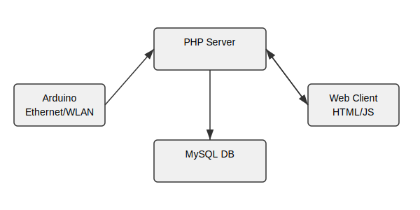

Slightly similar to  https://github.com/raumzeitlabor/raumzeitstatus but with a less complicated hardware setup and stats about single (Wifi) LAN users.

[List of technical ressources](resources.md) related to this project.

## Überblick

Autarc LAN User Stats ist ein kleines Experiment, das auf einem Arduino mit
Ethernet- bzw. WLAN‑Shield ausgeführt wird. Das Board durchsucht das lokale
Netz per Ping nach erreichbaren Geräten und überträgt die gefundenen
MAC‑/IP‑Adressen an einen PHP‑Server. Dort werden die Daten in einer MySQL
Datenbank gespeichert und können über einen einfachen Webclient abgerufen
werden.

### Idee und Zweck

Ziel ist es, eine leichtgewichtige Möglichkeit zu schaffen, die aktuelle
Teilnehmerzahl eines LANs bzw. WLANs zu ermitteln und Verlaufsstatistiken zu
führen. Denkbar sind weitere Auswertungen oder die Einbindung in andere
Dienste.

### Technologien

- Arduino‑Sketch in C/C++
- Ethernet/WLAN‑Shield (z.B. W5100)
- PHP‑Server mit MySQL‑Datenbank
- Optional: SD‑Karte für Logfiles, PHP‑Microframework "klein"

### Architektur

Die folgenden Komponenten arbeiten zusammen, um die Nutzungsstatistiken im LAN
zu erfassen. Die Skizze zeigt die wichtigsten Module und verwendeten
Technologien.

### Struktur

- `autarc_lan_user_stats/` – eigentlicher Arduino‑Code samt Default‑Konfig
- `server/` – PHP‑Skripte und SQL‑Schema zur Ablage der Statistiken
- `resources.md` sowie Bilder und Hilfsfunktionen als Dokumentation

### Anforderungen

- Arduino (UNO o. ä.) mit Netzwerk‑Shield
- installierte Bibliotheken `SPI` und `Ethernet`
- Server mit PHP (>=5) und MySQL
- optional eine SD‑Karte für lokale Logdateien

###Technical structure

###Configuration

